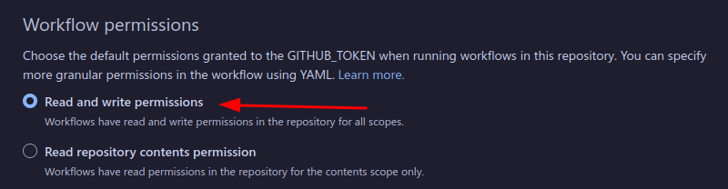

A new template for Svelte which can be deployed to github.io using GitHub CI

# Troubleshooting

### I got an permission error with this following error:
```
  remote: Permission to <user>/<repo> denied to github-actions[bot].
  fatal: unable to access 'https://github.com/<user>/<repo>': The requested URL returned error: 403
  Error: The process '/usr/bin/git' failed with exit code 128
```
<br>
<br>

You forgot to give your workflows permission to also have read & write access

Go to your repo's settings > actions and then toggle this


